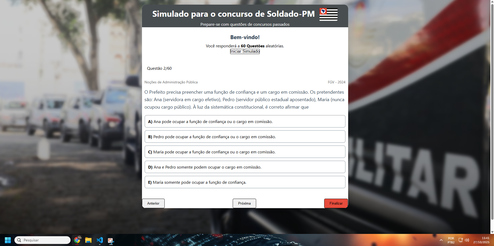

#  🎯 Simulado PM - Plataforma de Questões Gratuitas

Um projeto desenvolvido com **HTML5**, **CSS3** e **JavaScript**, com manipulação de **JSON**, para oferecer um **simulado gratuito para o concurso da Polícia Militar**
O objetivo é ajudar estudantes a se prepararem de forma prática e acessível, sem depender de plataformas pagas.

---

## Funcionalidades

- **Simulado gratuito** - o usuário inicia o simulado e recebe **60 questões aleatórias**.  
- **Questões reais:** todas as questões são de **concursos anteriores**, exibindo **ano e banca**.
- **Resultados automáticos:** ao finalizar o simulado, o sistema mostra:
   - Gabarito completo
   - Quantas questões o usuário acertou
   - Quantas errou  
- **Sorteio aleatório:** as questões são carregadas dinamicamente via JSON e sorteadas em tempo real.
- **Interface simples e responsiva** (em desenvolvimento).

---

## Tecnologias Utilizadas

- **HTML5** → estrutura da aplicação
- **CSS3** → estilização e layout
- **JavaScript** → lógica, manipulação do DOM e sorteio das questões 
- **JSON** → armazenamento e carregamento das questões

 Status do Projeto: **Em desenvolvimento**

Atualmente, o projeto possui 60 questões cadastradas, mas a meta é chegar a 500 questões no banco de dados, além de implementar:

- Sistema de categorias por disciplina

- Filtro por banca e ano

- Histórico de desempenho do usuário

- Salvamento de progresso com Local Storage

Este projeto nasceu com o propósito de democratizar o acesso ao conteúdo, oferecendo uma plataforma gratuita, leve e acessível, que qualquer pessoa possa usar para estudar.

**DEMONSTRAÇÃO**

👨‍💻 Autor: Eduardo Vieira (https://github.com/EduardoDevPy)
